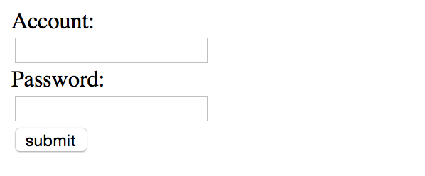
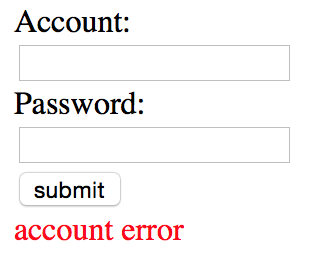
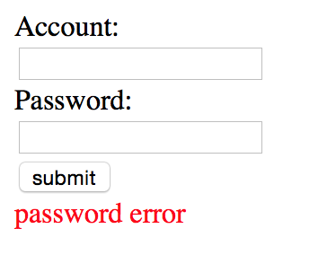
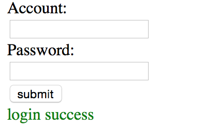
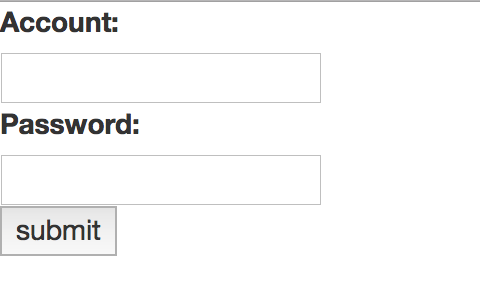
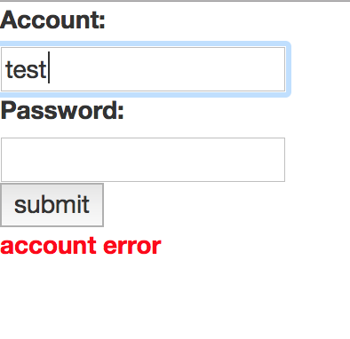
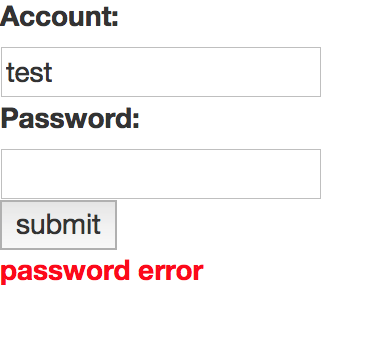
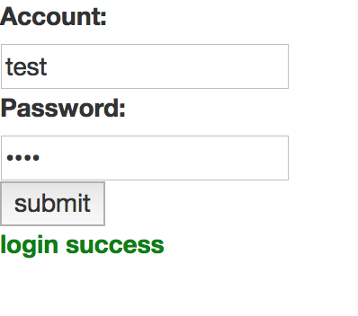

# 前言

在開始本章節以前先來談談MVC架構

#M(MODEL)V(VIEW)C(CONTROLL)

MVC是近年來流行的web架構，但這個概念並不限定在web上，連android都有實做類似的概念。
何謂MVC?你問工程師每個人的看法都不大一樣，但他們都一致同意好的工程師一定要會MVC。

在這裡提供wiki看法:

**（控制器 Controller）**- 負責轉發請求，對請求進行處理。

**（視圖 View）** - 介面設計人員進行圖形介面設計。

**（模型 Model）** - 程式設計師編寫程式應有的功能（實作演算法等等）、資料庫專家進行資料管理和資料庫設計(可以實作具體的功能)。

轉換成Node.js的說法就是：

**（控制器 Controller）**- server(express)，接受參數(POST OR GET)後轉傳至要執行的程式，若有需要則回傳結果。

**（視圖 View）** - html部分，為了輸出Controller的訊息，會需要用到view engine，下面會介紹ejs跟angular.js

**（模型 Model）**- 邏輯處理

# 實例一 MVC基本範例
讓我們做個範例，建立一個名叫**node_mvc_1**目錄

你可以參考 <https://github.com/y2468101216/node-wiki-gitbook/tree/master/src/node_mvc_1>

結構:

```
node_mvc_1/
├── bin/
|   ├── download.js
├── download/
│   ├── a.txt
│   ├── b.txt
├── public/
│   ├── index.html
└── app.js
```

bin/download.js:

```javascript
/**
 * Name:download.js
 * Purpose:Model download example
 * Author:Yun
 * Version:1.0
 * Update:2015-09-22
 */
module.exports = function(){
	this.checkFile = function(pathString, callback){
		var fs = require('fs');
		fs.stat(pathString,function(err, stats){
			if(!err){
				callback(true);
			}else{
				callback(false);
			}
		});
	}
}
```

public/index.html:

```html
<!DOCTYPE html>
<html>
<head>
<meta charset="UTF-8">
<title>Node MVC 1</title>
</head>
<body>
	<div>
		<a href="./download/a.txt">download a</a>
	</div>
	<div>
		<a href="./download/b.txt">download b</a>
	</div>
	<div>
		<a href="./download/c.txt">download c</a>
	</div>
</body>
</html>
```

app.js:

```javascript
/**
 * Name:app.js
 * Purpose:controller express example
 * Author:Yun
 * Version:1.0
 * Update:2015-09-22
 */

var express = require('express');
var app = express();

app.get('/', function(req, res) {
	var options = {
		root : __dirname + '/public/',
		dotfiles : 'deny',
		headers : {
			'x-timestamp' : Date.now(),
			'x-sent' : true
		}
	};

	res.sendFile('index.html', options, function(err) {
		if (err) {
			res.status(err.status).end();
		} else {
			// console.log('Sent:index.html');
		}
	});
});

app.get('/download/:name', function(req, res) {
	var downloadClass = require('./bin/download.js');
	var dl = new downloadClass();
	var pathString = './download/' + req.params.name;

	dl.checkFile(pathString, function(isFile) {
		if (isFile) {
			res.download(pathString);
		} else {
			res.send('error');
		}
	});
});

console.log('server is running');

app.listen(8080);
```

這是一個下載檔案的範例，在index.html裡有三個超連結分別對應a.txt、b.txt、c.txt。但你可以注意到在download目錄裡
並沒有c.txt，所以他應該會回傳error，不過今天的重點不在那邊，讓我們回頭來看app.js

app.js把檢查檔案是否存在的邏輯處理抽離另外做成一個class，讓app.js只單純處理controller的問題：轉傳給model，回傳給view。

這樣的好處是你易於維護，不會因為一個程式bug導致整個server crush，當然檔案跟程式碼會變得比較多，但整體而言複雜度是下降的。

#實例二 輸出文字
在Node.js裡面view engine分成兩個：jade跟ejs，我會談跟php想法比較接近的ejs。

如果跟我一樣有做過php的話，那你應該記得php本身即是個view engine這件事，但很可惜的是Node.js並不能直接
這樣輸出，但他有類似的東西可以讓你無痛轉換，沒錯！就是ejs

讓我們做個範例，建立一個名叫**node_mvc_2_ejs**目錄

你可以參考 <https://github.com/y2468101216/node-wiki-gitbook/tree/master/src/node_mvc_2_ejs>

先安裝ejs:

```
npm install ejs
```

結構:

```
node_mvc_2_ejs/
├── bin/
|   ├── login.js
├── views/
│   ├── index.html
└── app.js
```

login.js:

```javascript
/**
 * Name:login.js
 * Purpose:ejs login example
 * Author:Yun
 * Version:1.0
 * Update:2015-09-22
 */

module.exports = function (){
	this.check = function (account, password, callback){
		var message = 'login success';
		var error = false;

		if(account != 'test' && error == false){
			message = 'account error';
			error = true;

		}

		if(password != 'test' && error == false){
			message = 'password error';
			error = true;
		}

		callback(message, error);
	}
}
```

index.html:

```html
<!DOCTYPE html>
<html>
<head>
<meta charset="UTF-8">
<title>Node MVC 2 EJS</title>
</head>
<body>
<form action="/login" method="post">
	<div>
		<div><label>Account:</label></div>
		<input type="text" name="account" />
	</div>
	<div>
		<div><label>Password:</label></div>
		<input type="password" name="password" />
	</div>
	<div>
		<button type="submit">submit</button>
	</div>
	<% if (message) { %>
		<% if (error) { %>
			<label style="color:red;"><%= message %></label>
		<% } else { %>
		 	<label style="color:green;"><%= message %></label>
		 <% } %>
	 <% } %>
</form>
</body>
</html>
```

app.js:

```javascript
/**
 * Name:app.js
 * Purpose:ejs express example
 * Author:Yun
 * Version:1.0
 * Update:2015-09-22
 */

var express = require('express');
var bodyParser = require('body-parser');

var app = express();

//create application/x-www-form-urlencoded parser
app.use(bodyParser.urlencoded({
	extended : true
}));

app.set('views', __dirname + '/views');
app.set('view engine', 'ejs');
app.engine('html', require('ejs').renderFile);

//index page
app.get('/', function(req, res) {
    res.render('index.html',{message:false});
});

//login
app.post('/login',function(req, res){
	var loginClass = require('./bin/login.js');
	var login = new loginClass();
	login.check(req.body.account, req.body.password,function(returnMessage, isError){
		res.render('index.html',{message:returnMessage,error:isError});
	});
});

console.log('server is running');

app.listen(8080);
```









讓我們來討論一下app.js裡面多的東西

```javascript
app.use(bodyParser.urlencoded({
	extended : true
}));
```

這段是說如果封包裡的body有東西的話，用qs library去爬，關於要採用qs library還是query string
請參考以下連結：<http://stackoverflow.com/questions/29175465/body-parser-extended-option-qs-vs-querystring>

```javascript
app.set('views', __dirname + '/views');
app.set('view engine', 'ejs');
app.engine('html', require('ejs').renderFile);
```

app.set就是可以設定一些express的常數，讓他知道要去哪找。

第一行設定views的目錄在哪。

第二行設定要使用的view engine。

第三行設定說，如果是html的話一樣送給ejs解釋。也就是說現在你在目錄擺html跟ejs，都會被掃過看有沒有ejs語法。

#jade與ejs的優缺點
優點：

1. client端呈現速度快
2. 有學過view engine能夠快速上手

缺點：

1. server端要耗用資源
2. 版面醜陋
3. 做假資料時難度會提升很多
4. 對前端工程師不友善
5. 要多學一種語言

#另一個選擇-使用client side js framework:angular.js or react.js

有鑒於view engine的眾多缺點，逐漸有部分人改採用angular.js跟react.js做為view engine的替代品。

讓我們做個範例，建立一個名叫**node_mvc_3_angularjs**目錄

你可以參考 <https://github.com/y2468101216/node-wiki-gitbook/tree/master/src/node_mvc_3_angularjs>

結構：

```
node_mvc_3_angularjs/
├── bin/
|   ├── login.js
├── public/
│   ├── index.html
└── app.js
```

login.js:

```javascript
/**
 * Name:login.js
 * Purpose:ejs login example
 * Author:Yun
 * Version:1.0
 * Update:2015-09-22
 */

module.exports = function (){
	this.check = function (account, password, callback){
		var message = 'login success';
		var error = false;

		if(account != 'test' && error == false){
			message = 'account error';
			error = true;
		}

		if(password != 'test' && error == false){
			message = 'password error';
			error = true;
		}

		callback(message, error);
	}
}
```

index.html:

```html
<!DOCTYPE html>
<html ng-app="node_mvc_app">
<head>
<meta charset="UTF-8">
<title>Node MVC 3 angularjs</title>
<link rel="stylesheet" href="https://maxcdn.bootstrapcdn.com/bootstrap/3.3.1/css/bootstrap.min.css">
<script src="https://code.jquery.com/jquery-2.1.4.min.js"></script>
<script src="https://cdnjs.cloudflare.com/ajax/libs/angular.js/1.4.6/angular.min.js"></script>
</head>
<body ng-controller="node_mvc_controller">
<form>
	<div>
		<div><label>Account:</label></div>
		<input type="text" name="account" ng-model="user.account" />
	</div>
	<div>
		<div><label>Password:</label></div>
		<input type="password" name="password" ng-model="user.password" />
	</div>
	<div>
		<button type="button" ng-click="loginCheck()">submit</button>
	</div>

</form>
<label ng-style="messageStyle">{{message}}</label>
</body>
<script type="text/javascript">
var app = angular.module('node_mvc_app', []);
app.controller('node_mvc_controller',function($scope, $http){
	$scope.loginCheck = function () {
		var req = {
			method: 'POST',
			url: 'login',
			headers: {
				'Content-Type': 'application/x-www-form-urlencoded;charset=utf-8'
			},
			data: $.param($scope.user)
		}
		$http(req).success(function(data){
			if(data.error){
				$scope.messageStyle = {color:'red'};
			}else{
				$scope.messageStyle = {color:'green'};
			}
			$scope.message = data.message;
		});
	}
});
</script>
</html>

```

app.js:

```javascript
/**
 * Name:app.js
 * Purpose:ejs express example
 * Author:Yun
 * Version:1.0
 * Update:2015-09-22
 */

var express = require('express');
var bodyParser = require('body-parser');

var app = express();

var options = {
		root : __dirname + '/public/',
		dotfiles : 'deny',
		headers : {
			'x-timestamp' : Date.now(),
			'x-sent' : true
		}
	};

//create application/x-www-form-urlencoded parser
app.use(bodyParser.urlencoded({
	extended : true
}));

//index page
app.get('/', function(req, res) {
    res.sendFile('index.html',options,function(err){
    	if(err){
    		console.log(err);
    	}
    });
});

//login
app.post('/login',function(req, res){
	var loginClass = require('./bin/login.js');
	var login = new loginClass();
	login.check(req.body.account, req.body.password,function(returnMessage, isError){
		res.send({message:returnMessage,error:isError});
	});
});

console.log('server is running');

app.listen(8080);
```









login.js本身並沒有變動，所以我們直接來看index.html

這邊我們改用ajax去取得是否有登入成功。ajax會給使用者比較好的體驗，不然反覆刷新頁面使用者也很煩，
而且資料不用多做設定就可以一直留在網頁上，關於angular.js的語法可以參考<a href="https://angularjs.org">官網</a>，這邊就不再多做說明。

app.js因為我們不再使用ejs了，所以我們將app.set的部分全拿掉，這也導致res.render必須拿掉。
所以我們改成res.sendFile。

```javascript
res.sendFile('index.html',options,function(err){
	if(err){
		console.log(err);
	}
});
```

回傳的部分，server丟json出來是最好的，因為JavaScript對json的支援很好，而且在提供相同資訊的情況下
json遠比xml來的簡單。

```javascript

app.post('/login',function(req, res){
	var loginClass = require('./bin/login.js');
	var login = new loginClass();
	login.check(req.body.account, req.body.password,function(returnMessage, isError){
		res.send({message:returnMessage,error:isError});
	});
});

```

#client side js framework的優缺點
優點：

1. server耗用資源較少。
2. 版面整潔
3. 對前端友善
4. 做假資料時比較輕鬆

缺點：

1. include page會十分緩慢
2. 必定要先載入該framework
3. 使用者多時ajax可能會對server造成更多負擔

#結語
如上面所敘，兩種方法都有優缺點，開發時應該依照專案需求去做選擇，甚至可以兩種混用，不要被本篇文章侷限住了。

#參考資料
* wiki-MVC:<https://zh.wikipedia.org/wiki/MVC>
* angular.js:<https://angularjs.org>
* stackoverflow-qs_vs_querystring:<http://stackoverflow.com/questions/29175465/body-parser-extended-option-qs-vs-querystring>
