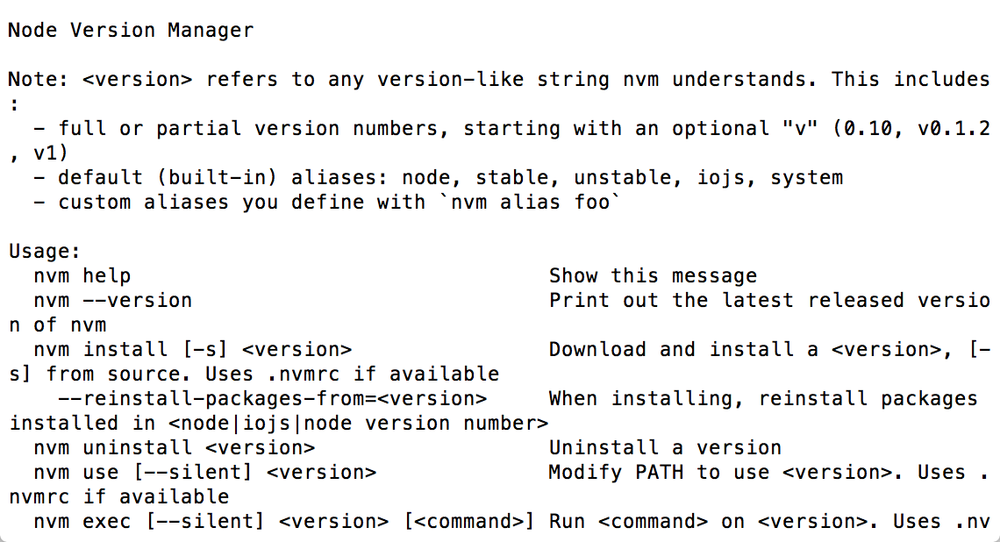
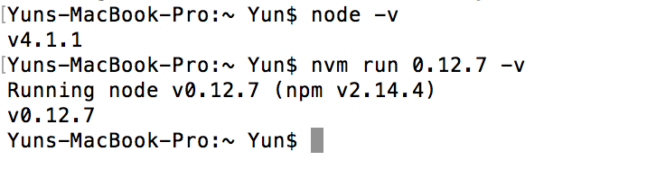

# Node.js 安裝與設定

本篇將講解如何在各個不同OS建立NodeJS 環境，目前NodeJS在不同作業系統中可以直接使用指令快速架設。以下各不同作業系統解說如何安裝NodeJS與nvm。

# What's nvm

nvm是一種Node.js的版本管理工具，在現在Node.js已經分成了stable跟develop，適時的切換版本是必須的。因為你有可能需要預先開發develop上的功能，但還是要維護stable上的bug，
且你使用nvm切換版本時npm也會一併安裝或切換。

Linux
============

在這裡我們不使用手動安裝，而是使用nvm自帶的install script

可以使用curl
```
curl -o- https://raw.githubusercontent.com/creationix/nvm/v0.29.0/install.sh | bash
```

或者Wget
```
wget -qO- https://raw.githubusercontent.com/creationix/nvm/v0.29.0/install.sh | bash
```

來執行這些install script，安裝完以後請重新連結你的vps或者重開你的server

手動安裝請依照參考資料裡nvm的github尋找Manual install的標題依序做下去(不推薦)

安裝完成後可以打

```
nvm
```

會顯示下面圖片：



# OSX

OSX同樣可以用curl or wget的install script來安裝(同上)，homebrew也可以，但我並不推薦，所以不再撰述。

# Windows

windows上並不支援nvm，但是有其他人開發了如nvmw、nvm-windows等來支援windows，這邊我們選擇star數比較多的nvm-windows來講解

installer link:<https://github.com/coreybutler/nvm-windows/releases>
選擇最新版nvm-setup.zip進行下載，解壓縮開了以後選擇nvm-setup.exe進行安裝，遵循指示下一步即可。

注意更新的時候只要重複安裝的步驟，安裝目錄選擇一樣就好。

# nvm指令簡介

這些nvm的指令皆可在<https://github.com/creationix/nvm>裡找到

* install

```
nvm install 4.2.1
nvm install stable
```   

這個指令是使用Node.js必須先做的，因為在安裝完nvm後Node.js並沒有被安裝。
你可以看到他可以帶兩種參數，一個是版本號、一個是stable or unstable。

版本號除了第一位必填以外，其他都選填，沒填的情況下會自動抓該版本下最新的。
EX:nvm install 4會安裝4.2.1

stable or unstable一個是安裝穩定版、一個是安裝最新版，不過就現在而言兩者是一樣的(2015-10-14)。

* use

```
npm use 4.2.1
npm use stable
```

此指令會切換node的版本，你可以在cmd或者terminal打：

```
node -v
```

查看現在版本，參數的設定同install。

* run

```
nvm run 4.2.1 [node file or node command]
nvm run stable [node file or node command]
```

要求nvm以特定版本運行node file或者node command，在測試ES6跟非ES6的code此功能十分重要。
此功能不會影響你本機裡的版本

EX:假設妳現在系統版本是4.1.1



由圖可以知道run的版本不受到現在系統版本的影響

* ls

```
nvm ls
nvm ls-remote
```

ls可以讓你查看"本地端"安裝的所有版本
ls-remote可以讓你查看，現在官方放出的所有版本。

* 設定node預設使用版本

```
nvm alias default stable
nvm alias default 4.2.1
```

此指令可以讓你設定每次開啟terminal的node預設版本是多少

# 結語

nvm是每個開發者都需要學習的東西，我建議務必做一遍，而不要從官網上下載檔案來安裝。

# 參考資料

* nvm:<https://github.com/creationix/nvm>
* nvm-windows:<https://github.com/coreybutler/nvm-windows>
