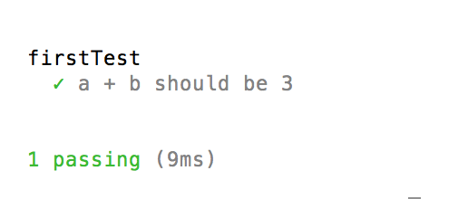

#  前言

test是程式中很重要的一環，本篇我們將會介紹如何用mocha.js撰寫test case。

# 原始碼

<https://github.com/y2468101216/node-wiki-gitbook/tree/master/src/node_test>

# 為何要寫測試

1. 先寫測試在開發程式有助於釐清你程式該如何寫。
2. 出現邏輯上的錯誤時只要跑測試就可以知道哪裡出錯，不必慢慢猜測。
3. 測試時可以釐清是哪個模組出錯了。

# 測試的層級

1. 單元測試
2. 整合測試
3. 使用者測試

單元測試最易除錯，但不貼近使用行為，使用者測試則相反。
本篇我們只會講單元測試

# TDD 與 BDD的差別

他們的差別只在於對測試案例的描述，舉例來講:

今天我想要測試1+1=2這件事

TDD: 1+1 equals 2

BDD: 1+1 should be 2

TDD會比較傾向程式語言的描述，BDD會比較人性化。

如果不知道要用哪種就用BDD，看懂最重要。

# 安裝mocha.js

使用npm安裝

```

$ npm install -g mocha

```

# mocha.js常用語法

before:全部測試開始之前先執行

it:測試案例

after:全部測試結束以後執行

beforeEach:每個測試前先執行

afterEach:每個測試後先執行

# mocha.js 的第一個測試案例

firsrTest.js

```javascript

var a;
var b;
var assert = require('assert');

describe('firstTest', function () {
	before(function () {
		a = 1;
		b = 2;
	});

	it('a + b should be 3', function () {
		assert.equal(a + b, 3);
	});
});

```

切換到該檔案目錄底下執行:

```

$ mocha firsrTest.js

```



# 比較object & array

arrayTest.js

```javascript

var actual;
var exected;
var assert = require('assert');

describe('arrayTest', function () {
	before(function () {
		actual = [1, 2, 3];
		exected = [1, 2, 3];
	});

	it('[1,2,3] equal [1,2,3]', function () {
		assert.equal(actual, exected);
	});

	it('[1,2,3] deepequal [1,2,3]', function () {
		assert.deepEqual(actual, exected);
	});
});

```

第一個是一定不會過的，因為他們是兩個不同的array。
要比較這兩種請用deepEqual。

* 附註

```javascript

actual = [1,2,3];
exected = actual;

```

這樣的話equal就會過，因為兩個是一樣的object了。

# async

asyncTest.js

```javascript

var assert = require('assert');

describe('asyncTest', function () {

	it('async_Test_Without_Done()', function () {
		var actual;
		var exected;
		var fs = require('fs');
		fs.stat('./asyncTest.js', function (err, stats) {
			var actual = stats.isFile();
			var exected = false;
			assert.equal(actual, exected);
		});
	});

	it('async_Test_With_Done()', function (done) {
		var actual;
		var exected;
		var fs = require('fs');
		fs.stat('./asyncTest.js', function (err, stats) {
			var actual = stats.isFile();
			var exected = false;
			assert.equal(actual, exected);
			done();
		});
	});


}); 

```

因為javascript的async特性，所以在做這種async的操作要記得放done()，確保不會立即回傳測試結果。

# 外部依賴

有的時候你想測試的function必須用到外面的class，而那個class還沒寫好怎辦？
最常見的就是ORM還沒寫好，但你需要串資料庫。

沒關係我們可以模擬該class的行為，假裝有那個class的存在，就是所謂的interface拉。

interfaceTest.js:

```javascript

var dbConn = {};
var assert = require('assert');
var order = require('./bin/order.js');
var orderTest = new order();


describe('firstTest', function () {
	before(function () {
		dbConn.Memberselect = function (memberName) {
			if (typeof memberName == 'string') {
				if (memberName == 'a') {
					var cursor = { 1: { name: 'a', price: 100, numbers: 1 }, 2: { name: 'b', price: 200, numbers: 2 } };
				} else {
					var cursor = null;
				}
			} else {
				var cursor = null;
			}
			return cursor;
		}
	});

	it('price total should be 500', function () {
		var cursor = dbConn.Memberselect('a');
		orderTest.setOrder(cursor);
		var expected = 500;
		var actual = orderTest.priceTotal();
		assert.equal(actual, expected);
	});
	
	it('price total should be 0', function () {
		var cursor = dbConn.Memberselect(null);
		orderTest.setOrder(cursor);
		var expected = 500;
		var actual = orderTest.priceTotal();
		assert.equal(actual, expected);
	});
});

```

我設計了一個計算訂單總金額的功能，這個訂單會從DB裡面被撈出來，但ORM還沒寫好。
於是我模擬了ORM的行為去避免這個問題。

# nightwatch.js

這是一個測試前端的好工具...（feature)

# 測試應該注意的幾個事項

1. 不要為了測試而測試
2. 不要強求測試覆蓋率
3. 只針對重要部分做測試，你是來做產品的不是來寫測試的(除非你是QA)
4. 應從單元測試一路往上做到使用者測試

# 結語

雖然大部分的時候你都沒時間寫測試，但是先寫測試在除錯的時候才會快，相形之下你節省時間更多，而且才能更快確定是哪個模組出錯。

好測試，不寫嗎？

# 參考資料

* mocha.js:<https://mochajs.org>
* tdd vs bdd:<http://www.toptal.com/freelance/your-boss-won-t-appreciate-tdd-try-bdd>