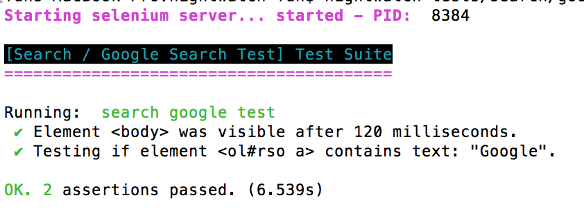

#  前言

test是程式中很重要的一環，本篇我們將會介紹如何用mocha.js跟nightwatch.js撰寫test case。

# 原始碼

<https://github.com/y2468101216/node-wiki-gitbook/tree/master/src/node_test>

# 為何我們要使用TDD，或者說寫測試有何好處

TDD是一種用測試來進行開發的模式，所以他的本質其實是為了開發而非測試。

Kent Beck(設計模式的先驅者)在RIP TDD裡舉出了8個你應該使用TDD的理由。

1. Over-engineering(過度設計):

EX:
今天你被授命要做一個會員登入的系統，你老闆只要你串facebook登入，結果你多寫了一個google登入。
這樣就過度設計了，程式碼裡不要擺用不到的東西，會造成後面維護上的困擾。

TDD每一個測試都是需求，而你不應該寫需求以外的程式，TDD力求以最簡單的方法讓測試通過。

2. API feedback(介面回饋):

因為TDD會根據使用者的需求寫測試，當你發現 你的介面不敷使用於測試時，就會去修改介面，這會使你的介面越來越貼近使用者。

3. Logic errors(邏輯錯誤):

TDD裡面不會有任何的邏輯(if else)判斷，所以如果出來的結果不符合就是你的method有問題。
而且TDD一次只會有一個測試失敗，所以一定是你剛增加的code有問題。

4. Documentation(文件):

每個工程師都會跟你說他討厭程式沒有文件，但實際上會寫文件的很少，後面會繼續維護的更少了。

TDD的測試即文件，當你看完測試你就會瞭解這隻程式怎用了。
而且如果需求改變，你的測試也會改變，就會很自然地維護它了。

5. Feeling overwhelmed:

標題無關。

TDD的宗旨是先寫測試在開發，意味著即使沒有程式依然可以先寫測試，

6. Separate interface from implementation thinking(從邏輯來實踐獨立介面):

EX:
今天有個需求是串金流API，但是開發API的人說他要等上線前10天才能給你測試。

TDD遇到這種問題時就會做一個介面，測試時實作這個介面，去模擬API的行為。
這樣你就不用因為別人拖延自己的進度。

7. Agreement(同意)

當你把需求解掉了以後，你要如何說服發出需求的人妳已經把問題解決掉了？
顯然用測試是一個好方法。

8. Anxiety(焦慮)

當老闆問你一切是否OK時，TDD可以不用讓你提心吊膽的說OK。

# 測試方法的層級

1. 單元測試
2. 整合測試
3. 使用者測試

單元測試最易除錯，但不貼近使用行為，使用者測試則相反。


# TDD 與 BDD的差別


# 安裝mocha.js

使用npm安裝

```
$ npm install -g mocha
```

# mocha.js常用語法

before:全部測試開始之前先執行

it:測試案例

after:全部測試結束以後執行

beforeEach:每個測試前先執行

afterEach:每個測試後先執行

# mocha.js 的第一個測試案例

firsrTest.js

```javascript
var a;
var b;
var assert = require('assert');

describe('firstTest', function () {
	before(function () {
		a = 1;
		b = 2;
	});

	it('a + b should be 3', function () {
		assert.equal(a + b, 3);
	});
});
```

切換到該檔案目錄底下執行:

```
$ mocha firsrTest.js
```


# 比較object & array

arrayTest.js

```javascript
var actual;
var exected;
var assert = require('assert');

describe('arrayTest', function () {
	before(function () {
		actual = [1, 2, 3];
		exected = [1, 2, 3];
	});

	it('[1,2,3] equal [1,2,3]', function () {
		assert.equal(actual, exected);
	});

	it('[1,2,3] deepequal [1,2,3]', function () {
		assert.deepEqual(actual, exected);
	});
});
```

第一個是一定不會過的，因為他們是兩個不同的array。
要比較這兩種請用deepEqual。

* 附註

```javascript
actual = [1,2,3];
exected = actual;
```

這樣的話equal就會過，因為兩個是一樣的object了。

# async

asyncTest.js

```javascript
var assert = require('assert');

describe('asyncTest', function () {

	it('async_Test_Without_Done()', function () {
		var actual;
		var exected;
		var fs = require('fs');
		fs.stat('./asyncTest.js', function (err, stats) {
			var actual = stats.isFile();
			var exected = false;
			assert.equal(actual, exected);
		});
	});

	it('async_Test_With_Done()', function (done) {
		var actual;
		var exected;
		var fs = require('fs');
		fs.stat('./asyncTest.js', function (err, stats) {
			var actual = stats.isFile();
			var exected = false;
			assert.equal(actual, exected);
			done();
		});
	});
});
```

因為javascript的async特性，所以在做這種async的操作要記得放done()，確保不會立即回傳測試結果。

# 外部依賴

有的時候你想測試的function必須用到外面的class，而那個class還沒寫好怎辦？
最常見的就是ORM還沒寫好，但你需要串資料庫。

沒關係我們可以模擬該class的行為，假裝有那個class的存在。

interfaceTest.js:

```javascript
var dbConn = {};
var assert = require('assert');
var order = require('./bin/order.js');
var orderTest = new order();


describe('firstTest', function () {
	before(function () {
		dbConn.Memberselect = function (memberName) {
			if (typeof memberName == 'string') {
				if (memberName == 'a') {
					var cursor = { 1: { name: 'a', price: 100, numbers: 1 }, 2: { name: 'b', price: 200, numbers: 2 } };
				} else {
					var cursor = null;
				}
			} else {
				var cursor = null;
			}
			return cursor;
		}
	});

	it('price total should be 500', function () {
		var cursor = dbConn.Memberselect('a');
		orderTest.setOrder(cursor);
		var expected = 500;
		var actual = orderTest.priceTotal();
		assert.equal(actual, expected);
	});

	it('price total should be 0', function () {
		var cursor = dbConn.Memberselect(null);
		orderTest.setOrder(cursor);
		var expected = 500;
		var actual = orderTest.priceTotal();
		assert.equal(actual, expected);
	});
});
```

我設計了一個計算訂單總金額的功能，這個訂單會從DB裡面被撈出來，但ORM還沒寫好。
於是我模擬了ORM的行為去避免這個問題。

# nightwatch.js簡介(整合測試)

這是一個測試end to end的好工具，她與Selenium結合使其可以自動打開browser做end to end測試，一般而言他會歸在整合測試中，但他也可以拿來做使用者測試。

# 使用時機
 
1. 當你想要重構某支程式，而他並不適合寫unit test
2. 給PM或者那些不懂程式的人看你的程式是如何運行的
3. 想要測試流程時，比如登入行為
4. 想要測試前端
 
# 安裝nightwatch.js

跟mocha一樣，我們希望它可以可以在系統的任何地方run。

```
$ npm install nightwatch
```

# Selenium安裝

Selenium需要java支援，請先確定你的PC上有java

然後我們需要下載Selenium<http://selenium-release.storage.googleapis.com/index.html>
請點選網址後下載最新版的

* option

Selenium本身就內建支援firefox，但是如果你想支援chrome的話就要另外下載chromedriver。
請至<https://sites.google.com/a/chromium.org/chromedriver/downloads>下載最新版

# 設定環境

這邊我只挑基本常用的的出來講，其餘可以看nightwatch.js官網裡的doc

請先新增一個目錄，內容如下

```
nightwatch
nightwatch.json
libs/
  ├── selenium-server-standalone.jar
  ├── chromedriver
reports/
screenshots/
tests/
  └── search
      └── googleSearchTest.js
```

在你的測試專案根目錄新增nightwatch.json:

```json
{
  "src_folders" : ["tests"],//你的測試檔案目錄
  "output_folder" : "reports",//如果要輸出報告時，輸出的目錄
  "custom_commands_path" : "",
  "custom_assertions_path" : "",
  "page_objects_path" : "",
  "globals_path" : "",

  //selenium設定
  "selenium" : {
    "start_process" : false, //是否自動啟動Selenium
    "server_path" : "",//Selenium jar位置
    "log_path" : "",//輸出Selenium的log位置
    "host" : "127.0.0.1",//設定Selenium 伺服器IP
    "port" : 4444,//設定Selenium 伺服器PORT
    "cli_args" : {
      "webdriver.chrome.driver" : "",//chromedriver位置
      "webdriver.ie.driver" : ""//IE eats shit
    }
  },
  //測試設定
  "test_settings" : {
    "default" : {
      "launch_url" : "http://localhost",
      "selenium_port"  : 4444,//連結Selenium 伺服器PORT
      "selenium_host"  : "localhost",//連結Selenium 伺服器網址
      "silent": true,
      "screenshots" : {
        "enabled" : true,//是否拍照
  		"on_failure" : true,//測試失敗時拍照
 		"on_error" : false,//指令錯誤時拍照
  		"path" : ""//拍照路徑
      },
	  //預設啟動的browser
      "desiredCapabilities": {
        "browserName": "firefox",//預設啟動的browser
        "javascriptEnabled": true,
        "acceptSslCerts": true
      }
    },

	//自定義browser，之後使用nightwatch可能會用到
    "chrome" : {
      "desiredCapabilities": {
        "browserName": "chrome",//預設啟動的browser
        "javascriptEnabled": true,
        "acceptSslCerts": true
      }
    }
  }
}


```

* option

如果你想要自動啟動Selenium的話請更改你的nightwatch.json為

```json
start_process : true,
server_path : "/你的目錄/selenium-server-standalone-{VERSION}.jar"
```

linux&mac:

新增一個nightwatch檔案在專案根目錄底下，內容如下

```javascript
#!/usr/bin/env node
require('nightwatch/bin/runner.js');

```

把它設定為可執行
```
$ chmod a+x nightwatch

```

windows:

新增一個nightwatch.js檔案在專案根目錄底下，內容如下

```javascript
require('nightwatch/bin/runner.js');

```

用node先跑起來

```
> node nightwatch.js

```

# nightwatch.js的第一個測試

search/googleSearch.js:

```javascript
module.exports = {
	'search google test':function(browser){
		browser
		.url('http://www.google.com.tw')
		.waitForElementVisible('body', 1000)
		.setValue('input[type=text]', 'google')
		.keys(browser.Keys.ENTER)
		.pause(1000)
		.assert.containsText("ol#rso a", "Google")
		.end();
	}
}

```

* option

如果你並沒有設定Selenium自動執行，請先手動執行

```
$ java -jar selenium-server-standalone-{VERSION}.jar

```

進行測試，測試前請先切換到專案根目錄：

```
$ nightwatch tests/search/googleSearchTest.js

```



# 測試應該注意的幾個事項

1. 不要為了測試而測試
2. 不要強求測試覆蓋率
3. 只針對重要部分做測試，你是來做產品的不是來寫測試的(除非你是QA)
4. 應從單元測試一路往上做到使用者測試

# 結語

雖然大部分的時候你都沒時間寫測試，但是先寫測試在除錯的時候才會快，相形之下你節省時間更多，而且才能更快確定是哪個模組出錯。

好測試，不寫嗎？

# 參考資料

* mocha.js:<https://mochajs.org>
* nightwatch.js:<http://nightwatchjs.org>
* RIP tdd:<https://www.facebook.com/notes/kent-beck/rip-tdd/750840194948847>
* tdd vs bdd:<http://www.toptal.com/freelance/your-boss-won-t-appreciate-tdd-try-bdd>
